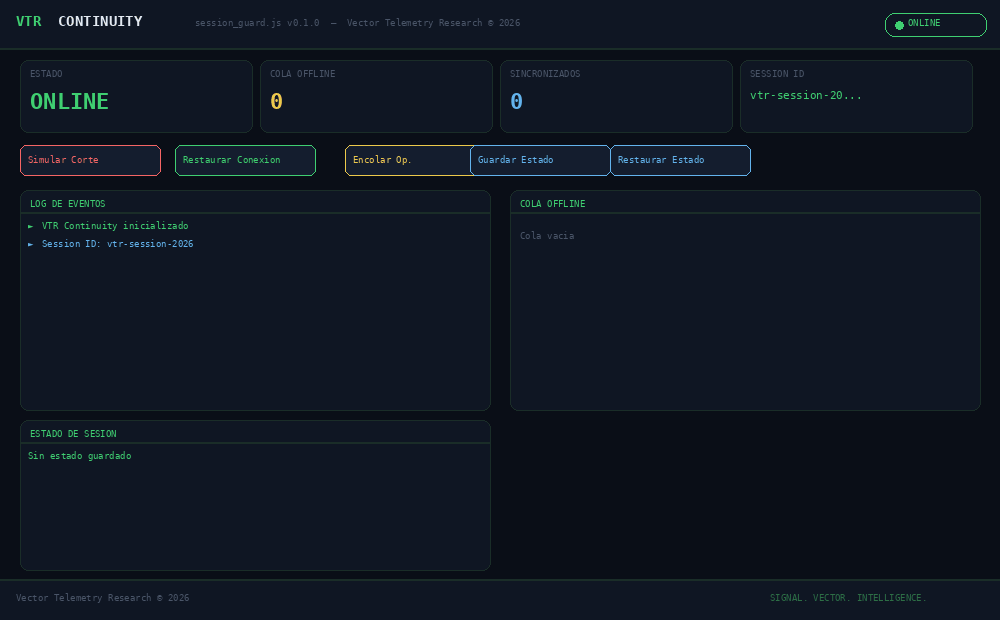

# VTR Continuity — session_guard.js
Vector Telemetry Research © 2026

## Demo

## Roadmap

### v0.1.0 — Core (actual)
- [x] SessionGuard — orquestador principal
- [x] StateSnapshot — cifrado AES-GCM en IndexedDB
- [x] OfflineQueue — cola con idempotency keys UUID v4
- [x] HeartbeatMonitor — backoff exponencial
- [x] SyncManager — sincronización FIFO al reconectar
- [x] 41/41 tests — Jest
- [x] Demo interactiva

### v0.2.0 — RPi 4 OT Tier (planificado)
- [ ] Proxy local de sincronizacion para entornos DMZ/air-gapped
- [ ] Receptor de cola offline via HTTP local (sin internet)
- [ ] Persistencia en SQLite local en RPi 4
- [ ] Reenvio a servidor central cuando OT network se restaura
- [ ] Compatible con redes Modbus/DNP3

### v0.3.0 — Integracion VTR (planificado)
- [ ] Integracion nativa con Tampico Shield alerts
- [ ] Export de eventos de sesion a storage/db.py
- [ ] Dashboard en Web SOC de Tampico Shield

### v0.4.0 — Enterprise OT (planificado)
- [ ] Soporte multi-HMI (Ignition, WinCC OA, iFIX WebSpace)
- [ ] Autenticacion JWT con refresh token rotation
- [ ] Cifrado end-to-end entre HMI y RPi 4 tier
- [ ] Auditoria de sesiones para cumplimiento NERC CIP / IEC 62443

### v0.5.0 — Fallback Tier 2 RF (en evaluacion)
- [ ] Ruta A: Banda ISM 915 MHz LoRa sin licencia — ESP32+SX1276, desplegable hoy
- [ ] Ruta B: Concesion IFT red privada — VTR opera RF como servicio administrado
- [ ] Serializacion Protobuf+LZ4
- [ ] Cifrado XChaCha20-Poly1305 + firma Ed25519
- [ ] LoRa L1 primario, BLE Mesh corto alcance
- [ ] DTN Bundle Protocol RFC 9171 capa L2
- [ ] UI: boton Abrir Canal Alterno tras 10min OFFLINE
- [ ] Sneakernet .vtrc como fallback extremo
